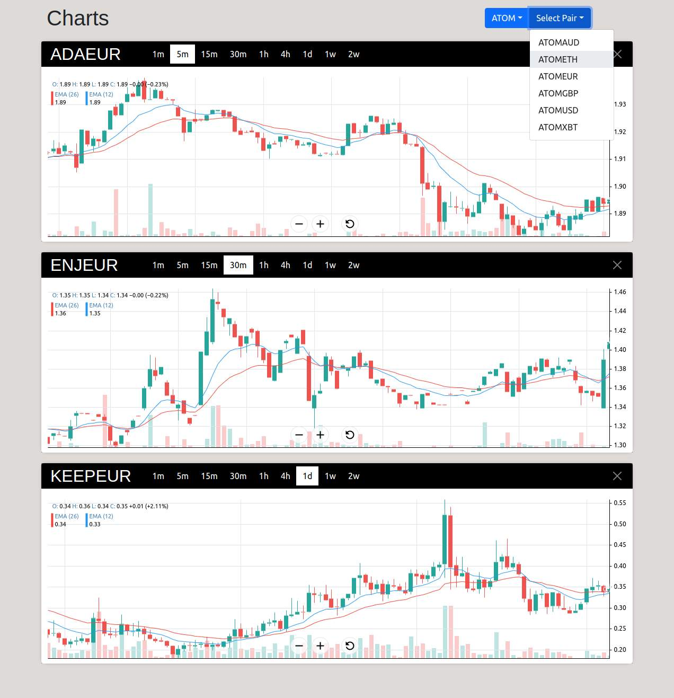

# Crypto Assets Monitor

An simple web application to view asset charts from kraken exchange public api

## What's inside

- **Frontend:** Typescript using React, Redux-Toolkit, Bootstrap, react-financial-charts
- **Backend:** Javascript using Express

## What provides

- Candlestick charts
- With Trade volume
- With EMA12 and EMA26 indicators




## Download

```bash
git clone https://github.com/vaidis/CryptoAssets-Monitor.git
```

## Install

```bash
cd CryptoAssets-Monitor

# Back-end
cd Back
npm install

# Front-end
cd Front
npm install
```

## Run

```bash
# Back-end
cd Back
npm start

# Front-end
cd Front
npm start
```

## Todo

- [] Responsive design
- [] Tests
- [] Theming error and loading messages
- [] More indicators
